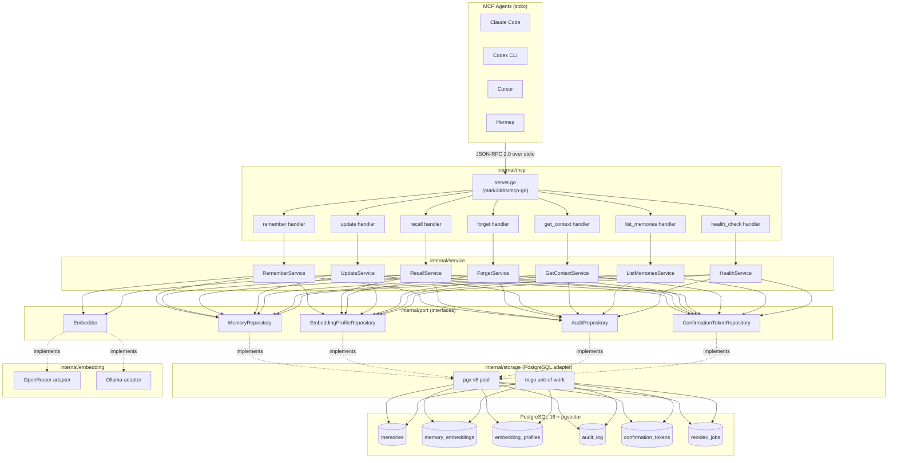
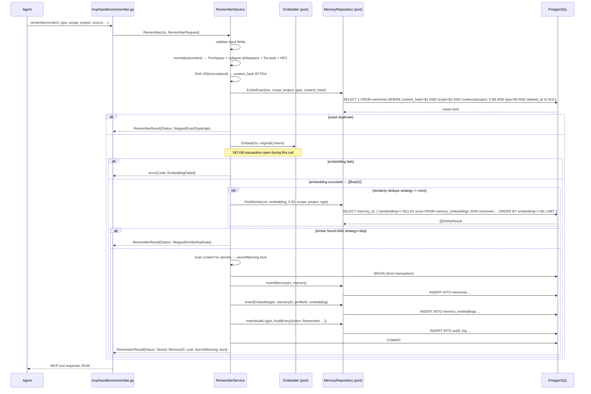

# TRD: Memora v0.1.0

## 1. Overview

Memora is a local-first MCP memory server that enables multiple AI agents (Claude Code, Codex CLI, Cursor, Hermes) running on the same machine to share durable, searchable knowledge. It exposes seven MCP tools over stdio, backed by PostgreSQL 16 + pgvector. The system is implemented in Go using clean/hexagonal architecture: domain logic is isolated from transport, storage, and embedding adapters. v0.1.0 establishes the full production foundation — durable storage, semantic/keyword/hybrid recall, configurable embedding profiles, deduplication, soft-delete safety, and audit logging — while keeping the runtime dependency surface minimal (PostgreSQL only, no Redis).

---

## 2. Problem / Background

Local AI agents operate in isolated contexts. Claude Code, Codex CLI, Cursor, and Hermes each accumulate facts, project conventions, user preferences, and architectural decisions within a session, but that knowledge does not persist across sessions or transfer between tools. The user repeatedly restates the same context. Memora provides a shared durable memory layer accessible to any MCP-compatible agent via the standard stdio transport, requiring no per-agent custom integration beyond MCP config.

---

## 3. Scope & Non-goals

### In Scope

- Seven MCP tools: `remember`, `recall`, `get_context`, `list_memories`, `update_memory`, `forget`, `health_check`
- PostgreSQL 16 + pgvector storage with golang-migrate migrations
- Semantic search (exact pgvector), keyword search (PostgreSQL FTS, `simple` dictionary), hybrid recall
- Configurable embedding profiles: OpenRouter, OpenAI-compatible, Ollama, custom base URL
- Bring-your-own API keys via env-var references in YAML config
- Auto-detection of embedding dimensions at profile creation/test time
- Memory scopes: `global` and `project`; project isolation via app-level WHERE filters
- Memory types: `fact`, `decision`, `preference`, `project_context`
- Exact deduplication (SHA-256 of normalized content within scope/project/type)
- Similarity deduplication strategies: `none`, `warn`, `skip` (default `skip`, threshold 0.92 cosine)
- Optimistic concurrency for `update_memory` (expected version required)
- Two-phase soft-delete `forget` with DB-backed confirmation tokens (5-minute TTL, single-use)
- Audit log for all committed memory operations (retained forever in v1)
- Secret scanning on memory content (warn + flag, do not block)
- Synchronous foreground CLI re-embedding with resume/retry support
- CLI: `init`, `serve`, `migrate`, `health`, `install`, `embeddings`, `memories` commands
- `pkg/api`: thin public Go MCP client/types package
- Unit + integration (testcontainers-go) + E2E test layers
- Docker Compose for PostgreSQL 16 + pgvector
- GitHub Actions CI

### Non-goals (v0.1.0)

- HTTP server or Unix socket multi-client mode
- Redis (any purpose)
- Agent-level ACLs; access boundary is stdio MCP config
- PostgreSQL RLS (deferred to v2 multi-client mode)
- HNSW or IVFFlat approximate vector indexes
- Advanced BM25/RRF hybrid ranking
- Application-level content encryption
- Physical/secure delete (purge)
- Background worker service
- Full manual memory CRUD via CLI
- Web UI
- Prometheus/OpenTelemetry metrics
- Semantic duplicate merge
- Hosted/cloud deployment

---

## 4. Architecture / Design

### 4.1 Package Layout

```
memora/
├── cmd/
│   └── memora/
│       └── main.go                    # entrypoint only; wires cobra root
├── internal/
│   ├── domain/                        # entities, value objects, validation, domain errors
│   │   ├── memory.go                  # Memory, MemoryType, Scope, DedupeStrategy
│   │   ├── embedding.go               # EmbeddingProfile, MemoryEmbedding
│   │   ├── audit.go                   # AuditEntry, AuditAction
│   │   └── errors.go                  # typed domain errors (ErrNotFound, ErrVersionConflict, ...)
│   ├── port/                          # interfaces defined at consumer boundary
│   │   ├── memory_repo.go             # MemoryRepository, EmbeddingProfileRepository, AuditRepository
│   │   ├── embedder.go                # Embedder interface
│   │   └── extractor.go               # Extractor interface (optional auto-extract)
│   ├── service/                       # application services; import domain + port only
│   │   ├── remember.go                # RememberService
│   │   ├── recall.go                  # RecallService
│   │   ├── forget.go                  # ForgetService
│   │   ├── update.go                  # UpdateService
│   │   ├── context.go                 # GetContextService
│   │   ├── list.go                    # ListMemoriesService
│   │   └── health.go                  # HealthService
│   ├── storage/                       # PostgreSQL adapter; implements port interfaces
│   │   ├── memory_repo.go
│   │   ├── embedding_repo.go
│   │   ├── audit_repo.go
│   │   ├── confirmation_token_repo.go
│   │   ├── reindex_job_repo.go
│   │   ├── tx.go                      # transaction runner / unit-of-work helper
│   │   └── migrations/                # SQL files; embedded via //go:embed
│   │       ├── 000001_init.up.sql
│   │       └── 000001_init.down.sql
│   ├── embedding/                     # embedding provider adapters
│   │   ├── openrouter.go              # OpenRouter / OpenAI-compatible adapter
│   │   ├── ollama.go                  # Ollama local adapter
│   │   └── detect.go                  # dimension auto-detection
│   ├── extraction/                    # optional LLM extraction adapter
│   │   └── openrouter.go
│   ├── mcp/                           # MCP stdio server (mark3labs/mcp-go)
│   │   ├── server.go                  # server init, tool registration
│   │   └── handlers/                  # one file per tool
│   │       ├── remember.go
│   │       ├── recall.go
│   │       ├── get_context.go
│   │       ├── list_memories.go
│   │       ├── update_memory.go
│   │       ├── forget.go
│   │       └── health_check.go
│   ├── cli/                           # cobra command tree
│   │   ├── root.go
│   │   └── commands/
│   │       ├── init.go
│   │       ├── serve.go
│   │       ├── migrate.go
│   │       ├── health.go
│   │       ├── install.go
│   │       ├── embeddings.go
│   │       └── memories.go
│   └── config/                        # config loading; no external library
│       ├── config.go                  # Config struct + LoadConfig + validate
│       └── config_test.go
├── pkg/
│   └── api/                           # public thin Go MCP client/types
│       ├── client.go                  # StdioClient implements Client interface
│       ├── types.go                   # request/response structs for all 7 tools
│       └── client_test.go
├── migrations/                        # symlink or re-export of internal/storage/migrations
├── docker-compose.yml
├── go.mod                             # module: github.com/kidboy-man/memora
└── go.sum
```

**Layer dependency rules (enforced by package boundaries):**
- `domain/` → imports nothing from `internal/`
- `port/` → imports `domain/` only
- `service/` → imports `domain/`, `port/` only
- `storage/`, `embedding/`, `extraction/` → import `port/` (to implement) + `domain/`
- `mcp/handlers/` → import `service/` only; never import `storage/` directly
- `cli/commands/` → import `service/` + `config/` only
- `pkg/api/` → zero `internal/` imports

### 4.2 Component Diagram



### 4.3 Remember Flow (critical path)



### 4.4 Key Design Decisions

| Decision | Choice | Rationale |
|----------|--------|-----------|
| DB driver | pgx v5 direct | pgvector-go requires pgx v5; native pgtype avoids float32 serialization overhead |
| Migration | golang-migrate + `//go:embed` | Binary-embedded SQL; CLI-runnable; pgx v5 driver |
| CLI | cobra | 3-level subcommands; standard in production Go CLIs |
| Config | custom: `yaml.v3` + `os.ExpandEnv` + typed struct | `${VAR}` interpolation native; zero extra deps; trivially testable |
| Confirmation token | DB table | Survives process restart; explicit single-use; no secret key management |
| Project isolation | App-level WHERE on all repo functions | pgx pool + SET LOCAL requires every query in explicit tx; `list` without project has no clean RLS policy; RLS belongs in v2 multi-client mode |
| Content normalization | TrimSpace + collapse whitespace + ToLower + Unicode NFC | Catches whitespace/case variants; avoids false positives from aggressive stripping |
| Content hash | SHA-256 → `BYTEA` | Collision resistance for dedup; `BYTEA` more efficient than hex TEXT |
| MCP library | mark3labs/mcp-go | Battle-tested; stdio transport built-in; clean tool registration API |

---

## 5. API Contracts

All tools use MCP JSON-RPC 2.0 over stdio. Request/response types are defined in `pkg/api/types.go`.

### 5.1 `remember`

**Annotation:** write operation

**Request:**
```json
{
  "content":    "string (required, non-empty)",
  "type":       "fact | decision | preference | project_context (default: fact)",
  "scope":      "global | project (default: project if project provided, else global)",
  "project":    "string (required when scope=project)",
  "source":     "string (required, agent/process name)",
  "tags":       ["string"],
  "metadata":   { "key": "value" },
  "confidence": 0.0–1.0
}
```

**Response:**
```json
{
  "memory_id":        "uuid",
  "status":           "stored | skipped_exact_duplicate | skipped_similar_duplicate | warned_similar_duplicate",
  "duplicate_of":     "uuid (present when skipped/warned)",
  "similarity_score": 0.0–1.0,
  "secret_warning":   true
}
```

**Errors:**
| Code | Condition |
|------|-----------|
| `validation_error` | Missing required field, invalid type/scope, confidence out of range |
| `embedding_failed` | Embedding provider unreachable or returned error |
| `storage_error` | DB write failed after embedding succeeded |
| `no_active_profile` | No active embedding profile configured |

---

### 5.2 `recall`

**Annotation:** read-only

**Request:**
```json
{
  "query":          "string (required)",
  "project":        "string (optional)",
  "include_global": true,
  "mode":           "semantic | keyword | hybrid (default: hybrid)",
  "types":          ["fact"],
  "tags":           ["string"],
  "limit":          10
}
```

**Response:**
```json
{
  "memories": [
    {
      "id":         "uuid",
      "content":    "string",
      "type":       "fact",
      "scope":      "project",
      "project":    "string",
      "source":     "string",
      "tags":       ["string"],
      "metadata":   {},
      "confidence": 1.0,
      "version":    1,
      "created_at": "RFC3339",
      "updated_at": "RFC3339",
      "score":      0.0–1.0,
      "match_mode": "semantic | keyword | both"
    }
  ]
}
```

**Semantic recall SQL (active profile):**
```sql
SELECT m.*, 1 - (me.embedding <=> $1::vector) AS score
FROM memory_embeddings me
JOIN memories m ON m.id = me.memory_id
WHERE me.profile_id = $2
  AND m.deleted_at IS NULL
  AND (m.scope = 'global' OR m.project = $3)
ORDER BY me.embedding <=> $1::vector
LIMIT $4
```

**Keyword recall SQL:**
```sql
SELECT m.*, ts_rank(m.search_vector, plainto_tsquery('simple', $1)) AS score
FROM memories m
WHERE m.deleted_at IS NULL
  AND (m.scope = 'global' OR m.project = $2)
  AND m.search_vector @@ plainto_tsquery('simple', $1)
ORDER BY score DESC
LIMIT $3
```

**Hybrid merge:** union by `memory_id`, dedup; memories in both sets receive `score * 1.5` boost; sort by final score descending.

---

### 5.3 `get_context`

**Annotation:** read-only

**Request:**
```json
{
  "project":         "string (required)",
  "task_hint":       "string (optional, used as recall query)",
  "limit_per_group": 5
}
```

**Response:**
```json
{
  "global_preferences":  [Memory],
  "project_decisions":   [Memory],
  "project_context":     [Memory],
  "relevant_facts":      [Memory],
  "recently_updated":    [Memory]
}
```

`relevant_facts` uses hybrid recall with `task_hint` as query when provided. Other groups use `list_memories` filtered by type/scope/recency.

---

### 5.4 `list_memories`

**Annotation:** read-only

**Request:**
```json
{
  "scope":           "global | project (optional, omit for all)",
  "project":         "string (optional)",
  "include_global":  true,
  "types":           ["fact"],
  "tags":            ["string"],
  "source":          "string (optional)",
  "include_deleted": false,
  "cursor":          "opaque string (UUID of last seen memory_id)",
  "limit":           20
}
```

**Response:**
```json
{
  "memories":    [Memory],
  "next_cursor": "uuid | empty string",
  "total_count": 0
}
```

Cursor-based pagination: `WHERE id > $cursor ORDER BY id ASC LIMIT $limit`. `total_count` is approximate (does not re-count on every page).

---

### 5.5 `update_memory`

**Annotation:** write operation

**Request:**
```json
{
  "memory_id":        "uuid (required)",
  "expected_version": 1,
  "content":          "string (optional)",
  "tags":             ["string"],
  "metadata":         {},
  "confidence":       1.0
}
```

At least one of `content`, `tags`, `metadata`, or `confidence` must be provided.

**Response:**
```json
{
  "memory_id":  "uuid",
  "version":    2,
  "updated_at": "RFC3339"
}
```

**Update SQL (optimistic lock):**
```sql
UPDATE memories
SET content = $1, content_hash = $2, version = version + 1, updated_at = NOW()
WHERE id = $3 AND version = $4 AND deleted_at IS NULL
RETURNING version, updated_at
```

Zero rows returned → `ErrVersionConflict`.

**Errors:**
| Code | Condition |
|------|-----------|
| `not_found` | memory_id does not exist or is deleted |
| `version_conflict` | expected_version does not match current version |
| `embedding_failed` | Active-profile embedding recompute failed |

---

### 5.6 `forget`

**Annotation:** destructive operation

**Phase 1 — Request (no confirmation_token):**
```json
{ "memory_id": "uuid" }
```

**Phase 1 — Response:**
```json
{
  "status":             "confirmation_required",
  "preview": {
    "id":      "uuid",
    "excerpt": "first 200 chars of content",
    "type":    "fact",
    "scope":   "project",
    "project": "string"
  },
  "confirmation_token": "uuid",
  "expires_at":         "RFC3339 (now + 5 minutes)"
}
```

**Phase 2 — Request:**
```json
{
  "memory_id":          "uuid",
  "confirmation_token": "uuid",
  "reason":             "string (optional)"
}
```

**Phase 2 — Response:**
```json
{
  "status":     "forgotten",
  "memory_id":  "uuid",
  "deleted_at": "RFC3339"
}
```

**Phase 2 SQL sequence (inside transaction):**
```sql
-- 1. Validate and consume token
UPDATE confirmation_tokens
SET used_at = NOW()
WHERE id = $1
  AND memory_id = $2
  AND expires_at > NOW()
  AND used_at IS NULL
RETURNING id;
-- Zero rows → ErrTokenInvalid

-- 2. Soft-delete
UPDATE memories
SET deleted_at = NOW(), deleted_by = $source, delete_reason = $reason
WHERE id = $1 AND deleted_at IS NULL;
-- Zero rows → ErrAlreadyDeleted

-- 3. Audit log
INSERT INTO audit_log ...
```

**Errors:**
| Code | Condition |
|------|-----------|
| `not_found` | memory_id does not exist |
| `already_deleted` | memory already soft-deleted |
| `token_invalid` | token not found, expired, or already used |
| `token_mismatch` | token exists but memory_id does not match |

---

### 5.7 `health_check`

**Annotation:** read-only

**Request:** (no parameters)

**Response:**
```json
{
  "status": "healthy | degraded | unhealthy",
  "checks": {
    "config":            { "status": "ok | warn | error", "message": "string" },
    "database":          { "status": "ok | warn | error", "message": "string", "latency_ms": 0 },
    "pgvector":          { "status": "ok | warn | error", "message": "string" },
    "migrations":        { "status": "ok | warn | error", "message": "string" },
    "embedding_profile": { "status": "ok | warn | error", "message": "string" },
    "embedding_provider":{ "status": "ok | warn | error", "message": "string", "latency_ms": 0 }
  },
  "memory_counts": {
    "total":      0,
    "global":     0,
    "by_project": { "project_name": 0 }
  }
}
```

`status` = `healthy` if all checks `ok`; `degraded` if any `warn`; `unhealthy` if any `error`.

---

## 6. Database / Data Model

### 6.1 Extensions

```sql
CREATE EXTENSION IF NOT EXISTS "pgcrypto";  -- gen_random_uuid()
CREATE EXTENSION IF NOT EXISTS "vector";    -- pgvector
```

### 6.2 Schema

```sql
-- embedding_profiles
CREATE TABLE embedding_profiles (
    id              UUID        PRIMARY KEY DEFAULT gen_random_uuid(),
    name            TEXT        NOT NULL UNIQUE,
    provider        TEXT        NOT NULL,   -- 'openrouter' | 'openai' | 'ollama' | 'custom'
    model           TEXT        NOT NULL,
    api_base_url    TEXT        NOT NULL,
    dimensions      INTEGER     NOT NULL CHECK (dimensions > 0),
    distance_metric TEXT        NOT NULL DEFAULT 'cosine', -- 'cosine' | 'l2' | 'ip'
    is_active       BOOLEAN     NOT NULL DEFAULT FALSE,
    created_at      TIMESTAMPTZ NOT NULL DEFAULT NOW(),
    updated_at      TIMESTAMPTZ NOT NULL DEFAULT NOW()
);

-- Enforce single active profile
CREATE UNIQUE INDEX embedding_profiles_one_active
    ON embedding_profiles (is_active) WHERE is_active = TRUE;

-- memories (canonical content; embeddings stored separately)
CREATE TABLE memories (
    id              UUID        PRIMARY KEY DEFAULT gen_random_uuid(),
    content         TEXT        NOT NULL CHECK (length(content) > 0),
    content_hash    BYTEA       NOT NULL,   -- SHA-256(normalized content)
    type            TEXT        NOT NULL CHECK (type IN ('fact','decision','preference','project_context')),
    scope           TEXT        NOT NULL CHECK (scope IN ('global','project')),
    project         TEXT,                   -- NULL iff scope='global'
    source          TEXT        NOT NULL,
    tags            TEXT[]      NOT NULL DEFAULT '{}',
    metadata        JSONB       NOT NULL DEFAULT '{}',
    confidence      NUMERIC(4,3) NOT NULL DEFAULT 1.0 CHECK (confidence BETWEEN 0.0 AND 1.0),
    version         INTEGER     NOT NULL DEFAULT 1 CHECK (version > 0),
    -- soft delete
    deleted_at      TIMESTAMPTZ,
    deleted_by      TEXT,
    delete_reason   TEXT,
    -- audit
    created_at      TIMESTAMPTZ NOT NULL DEFAULT NOW(),
    updated_at      TIMESTAMPTZ NOT NULL DEFAULT NOW(),
    -- full-text search vector (generated, stored)
    search_vector   TSVECTOR    GENERATED ALWAYS AS (
        setweight(to_tsvector('simple', content), 'A') ||
        setweight(to_tsvector('simple', coalesce(array_to_string(tags, ' '), '')), 'B') ||
        setweight(to_tsvector('simple', coalesce(source, '')), 'C')
    ) STORED,
    -- scope/project consistency
    CONSTRAINT memories_project_scope_check CHECK (
        (scope = 'global' AND project IS NULL) OR
        (scope = 'project' AND project IS NOT NULL AND length(project) > 0)
    )
);

-- Dedup uniqueness: same normalized content in same (scope, project, type) bucket
-- coalesce(project, '') normalizes NULL project for global scope
CREATE UNIQUE INDEX memories_dedup
    ON memories (scope, coalesce(project, ''), type, content_hash)
    WHERE deleted_at IS NULL;

-- Query indexes
CREATE INDEX memories_scope_project  ON memories (scope, project) WHERE deleted_at IS NULL;
CREATE INDEX memories_type           ON memories (type) WHERE deleted_at IS NULL;
CREATE INDEX memories_source         ON memories (source) WHERE deleted_at IS NULL;
CREATE INDEX memories_tags           ON memories USING GIN (tags) WHERE deleted_at IS NULL;
CREATE INDEX memories_created_at     ON memories (created_at DESC);
CREATE INDEX memories_updated_at     ON memories (updated_at DESC) WHERE deleted_at IS NULL;
CREATE INDEX memories_search_vector  ON memories USING GIN (search_vector);

-- memory_embeddings (vector per memory per profile)
CREATE TABLE memory_embeddings (
    memory_id           UUID        NOT NULL REFERENCES memories(id) ON DELETE CASCADE,
    profile_id          UUID        NOT NULL REFERENCES embedding_profiles(id),
    embedding           VECTOR,     -- dimensionless; app validates against profile.dimensions
    embedding_dimension INTEGER     NOT NULL,
    content_hash        BYTEA       NOT NULL, -- copied from memory at embed time; used for reindex skip
    created_at          TIMESTAMPTZ NOT NULL DEFAULT NOW(),
    updated_at          TIMESTAMPTZ NOT NULL DEFAULT NOW(),
    PRIMARY KEY (memory_id, profile_id)
);

CREATE INDEX memory_embeddings_profile_id ON memory_embeddings (profile_id);

-- audit_log
CREATE TABLE audit_log (
    id          UUID         PRIMARY KEY DEFAULT gen_random_uuid(),
    occurred_at TIMESTAMPTZ  NOT NULL DEFAULT NOW(),
    action      TEXT         NOT NULL, -- 'remember'|'recall'|'update'|'forget'|'health_check'|'list'|'get_context'
    memory_id   UUID         REFERENCES memories(id),
    source      TEXT,
    scope       TEXT,
    project     TEXT,
    details     JSONB        NOT NULL DEFAULT '{}',
    duration_ms INTEGER,
    success     BOOLEAN      NOT NULL,
    error_msg   TEXT
);

CREATE INDEX audit_log_occurred_at ON audit_log (occurred_at DESC);
CREATE INDEX audit_log_memory_id   ON audit_log (memory_id) WHERE memory_id IS NOT NULL;
CREATE INDEX audit_log_action      ON audit_log (action);

-- confirmation_tokens (forget two-phase; single-use, 5-minute TTL)
CREATE TABLE confirmation_tokens (
    id          UUID        PRIMARY KEY DEFAULT gen_random_uuid(),
    memory_id   UUID        NOT NULL REFERENCES memories(id),
    expires_at  TIMESTAMPTZ NOT NULL,
    used_at     TIMESTAMPTZ,
    created_at  TIMESTAMPTZ NOT NULL DEFAULT NOW()
);

CREATE INDEX confirmation_tokens_memory_id  ON confirmation_tokens (memory_id);
CREATE INDEX confirmation_tokens_expires_at ON confirmation_tokens (expires_at);

-- reindex_jobs (resume/retry state for synchronous CLI reindex)
CREATE TABLE reindex_jobs (
    id              UUID        PRIMARY KEY DEFAULT gen_random_uuid(),
    profile_id      UUID        NOT NULL REFERENCES embedding_profiles(id),
    project         TEXT,       -- NULL = all projects
    status          TEXT        NOT NULL DEFAULT 'running', -- 'running'|'completed'|'failed'
    total_count     INTEGER,
    processed_count INTEGER     NOT NULL DEFAULT 0,
    skipped_count   INTEGER     NOT NULL DEFAULT 0,
    error_count     INTEGER     NOT NULL DEFAULT 0,
    last_memory_id  UUID,       -- cursor for resume
    started_at      TIMESTAMPTZ NOT NULL DEFAULT NOW(),
    completed_at    TIMESTAMPTZ
);
```

### 6.3 Migration Strategy

- Files live in `internal/storage/migrations/`, embedded via `//go:embed migrations/*.sql`
- golang-migrate with `pgx/v5` driver
- Naming: `NNNNNN_description.up.sql` / `NNNNNN_description.down.sql`
- `memora migrate up` runs pending migrations; `memora migrate down` rolls back one step
- CI runs migrations against testcontainers PostgreSQL before integration tests
- `memora serve` checks migration status at startup; warns if dirty, refuses to start if version behind

### 6.4 Vector Column Note

`memory_embeddings.embedding` uses `VECTOR` (no dimension suffix) because different profiles have different dimensions. Application layer validates `len(embedding) == profile.dimensions` before insert. The `embedding_dimension` column records the actual dimension stored for auditing and mismatch detection.

---

## 7. Security & Auth

### 7.1 API Keys

- Never stored raw in DB. Config YAML uses `${ENV_VAR}` references.
- `os.ExpandEnv` resolves references at load time; unexpanded values fail config validation.
- `validate(cfg)` checks required secrets are non-empty after expansion.
- Logs must never print config values; structured log fields use key names only.

### 7.2 Secret Scanning

Before inserting/updating a memory, `service/remember.go` runs `domain.ScanForSecrets(content)`:

- Regex patterns for: AWS access keys, GitHub tokens (`ghp_`, `ghs_`), generic API key patterns (`sk-`, `Bearer `, hex 32+char runs)
- Returns `secretWarning bool` — does not block the write
- Sets `metadata["contains_secret"] = true` on the stored memory
- Returns `secret_warning: true` in MCP tool response

Pattern list in `internal/domain/secrets.go`; must be easy to extend.

### 7.3 Remote Provider Disclosure

- `memora init` prints explicit warning before configuring a remote embedding provider: memory/query text will be sent to the configured provider
- README and install docs repeat this warning
- Ollama local provider documented as the privacy-preserving alternative

### 7.4 Prompt Injection Mitigation

Memories returned to agents are wrapped in structured JSON fields, not interpolated into system prompt text. The MCP response format treats memory content as data. Handlers must not construct strings like `"Here is context: " + memory.Content` for return.

### 7.5 Soft-Delete Disclosure

Documentation must state: soft-delete is not secure deletion. Content remains in DB rows with `deleted_at` set. Physical purge is out of scope for v1. Users requiring data erasure should use OS/disk encryption (LUKS/BitLocker/FileVault) as recommended in `memora init` output.

### 7.6 Confirmation Token Security

- `confirmation_tokens.id` is a UUID (random); not guessable
- TTL: 5 minutes (`expires_at = NOW() + INTERVAL '5 minutes'`)
- Single-use: `UPDATE ... SET used_at = NOW() WHERE used_at IS NULL` — zero rows = already used
- Token is bound to `memory_id`: phase 2 checks both match
- Startup cleanup: `DELETE FROM confirmation_tokens WHERE expires_at < NOW()` on server start

### 7.7 Access Control

v1 access boundary is stdio MCP configuration. Any process that can launch `memora serve --stdio` has full access to all memories. Agent-level ACLs deferred to v2.

---

## 8. Testing Strategy

### 8.1 Unit Tests

Location: `*_test.go` alongside source files.

Coverage targets: >80% for `internal/domain/` and `internal/service/`.

**Covered scenarios:**
- `domain/memory.go`: type/scope validation, content length, confidence range, project required for project scope
- `domain/secrets.go`: secret pattern matching; false positives; empty content
- `service/remember.go`: exact dedupe path, similarity skip/warn/none strategies, embedding failure path, secret warning propagation, audit log call
- `service/recall.go`: hybrid merge logic, score boosting when both modes match, dedup by memory ID
- `service/forget.go`: phase 1 token generation, phase 2 token validation, version conflict on concurrent delete
- `service/update.go`: version increment, embedding recompute called on content change, no recompute on tags-only update
- `internal/config/config.go`: env var expansion, missing required vars, invalid YAML
- `internal/mcp/handlers/`: each handler with mocked service returning success, validation error, not-found, version conflict

Use `testify/mock` or hand-written fakes injected at service constructor.

### 8.2 Integration Tests

Location: `internal/storage/*_integration_test.go`.

Require real PostgreSQL + pgvector via testcontainers-go. Build tag: `//go:build integration`.

**Covered scenarios:**
- Migration: apply up/down; dirty state detection
- `MemoryRepository.InsertMemory`: dedup constraint violation on exact hash collision
- `MemoryRepository.FindSimilar`: cosine similarity search returns correct ordering
- `MemoryRepository.InsertMemory` + `FindSimilar`: scope isolation (project A memories not returned for project B query)
- Soft-delete: deleted memories excluded from default queries; `include_deleted=true` returns them
- `UpdateMemory`: optimistic lock — concurrent update returns version conflict
- Audit log: entries written in same transaction as memory operation; rolled back on tx failure
- Confirmation token: used token returns zero rows on second use; expired token returns zero rows

### 8.3 End-to-End Tests

Location: `pkg/api/*_e2e_test.go`.

Use `pkg/api.StdioClient` to drive a live `memora serve --stdio` process against testcontainers PostgreSQL.

**Scenarios:**
1. `remember` → `recall`: stored memory appears in semantic, keyword, and hybrid results
2. `remember` duplicate → `recall`: `status=skipped_exact_duplicate`, recall returns original
3. `update_memory` → `recall`: updated content appears; old content absent
4. `forget` phase 1 → phase 2 → `recall`: deleted memory absent from default recall; present with `include_deleted=true`
5. `forget` phase 2 with expired token: returns `token_invalid`
6. `forget` phase 2 with already-used token: returns `token_invalid`
7. `health_check`: returns `status=healthy` on valid setup
8. Project isolation: project A memory not returned in project B recall (with `include_global=false`)
9. Global memory: visible in project A recall with `include_global=true`

### 8.4 CI (GitHub Actions)

```yaml
# .github/workflows/ci.yml (outline)
jobs:
  test:
    runs-on: ubuntu-latest
    steps:
      - uses: actions/setup-go@v5
        with: { go-version: '1.26.3' }
      - run: go fmt ./... && git diff --exit-code
      - run: go vet ./...
      - run: go test -race ./internal/domain/... ./internal/service/... ./internal/config/... ./pkg/api/...
      - run: go test -race -tags integration ./internal/storage/...
      - run: go test -race -tags integration ./pkg/api/...  # e2e
      - uses: codecov/codecov-action@v4
```

testcontainers-go manages PostgreSQL lifecycle; no external service dependency in CI.

---

## 9. Open Questions & Risks

| # | Question / Risk | Impact | Mitigation |
|---|----------------|--------|------------|
| 1 | **Local Go 1.24.3 must be upgraded.** Go 1.26.3 is current stable and required. Host WSL has 1.24.3. | Cannot build/test locally until upgraded | `sudo apt remove golang-go && wget https://go.dev/dl/go1.26.3.linux-amd64.tar.gz && sudo tar -C /usr/local -xzf go1.26.3.linux-amd64.tar.gz`. CI already targets 1.26.3. |
| 2 | **pgvector `VECTOR` without dimension — query planner behavior.** Exact search over `VECTOR` (no dim) vs `VECTOR(1536)` may differ in index eligibility for future HNSW. | Future v2 index migration complexity | `embedding_dimension` column records actual dim; adding a typed column in v2 migration is safe. |
| 3 | **mark3labs/mcp-go MCP protocol version.** MCP spec is still evolving; library may lag. | Tool annotation support may change | Pin library version; monitor MCP spec releases. |
| 4 | **Secret scanning false positive rate.** Overly broad patterns warn on legitimate content (hex IDs, base64). | Noisy `secret_warning` flags erode agent trust | Start with high-confidence patterns only (AWS AKIA, `ghp_`, `sk-` prefix); extend carefully. |
| 5 | **Similarity dedupe threshold (0.92) calibration.** May be too aggressive or too lenient for real-world memory content. | Under/over-deduplication | Make threshold configurable in config YAML defaults; document 0.92 as starting point. |
| 6 | **Embedding provider cold start latency.** First `remember` call after Ollama idle may time out. | `remember` fails with `embedding_failed` | Add configurable embedding timeout; document Ollama warmup behavior. |
| 7 | **reindex_jobs cursor correctness under concurrent CLI runs.** Two simultaneous `memora embeddings reindex` calls may process the same memories. | Duplicate embeddings (PK violation on `memory_embeddings`) | PK `(memory_id, profile_id)` handles this safely via `INSERT ... ON CONFLICT DO UPDATE`. Document: only one reindex per profile at a time. |
| 8 | **`memora init` interactive flow test coverage.** Interactive CLI prompts are hard to unit-test. | Low confidence in init reliability | Test config write/validate logic separately; use a `--non-interactive` flag with env var inputs for CI testing of init. |
